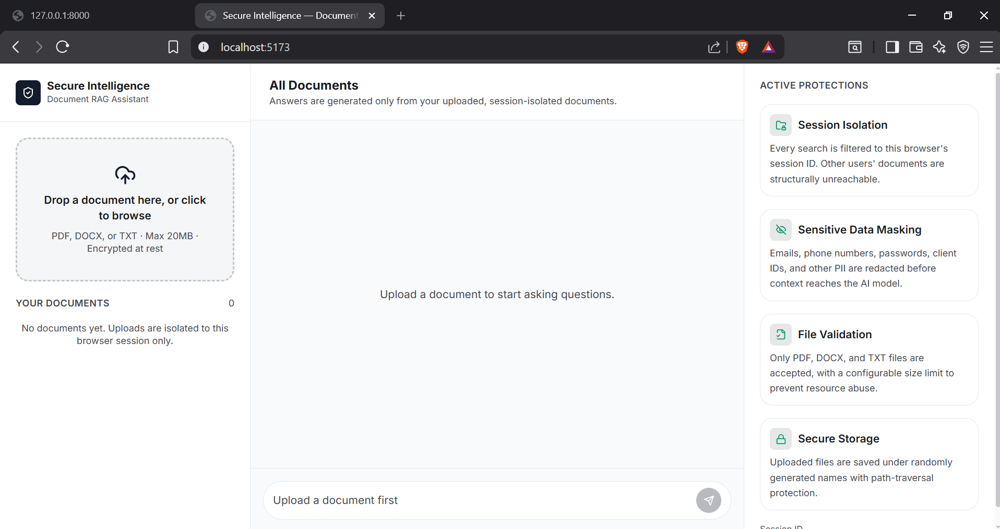
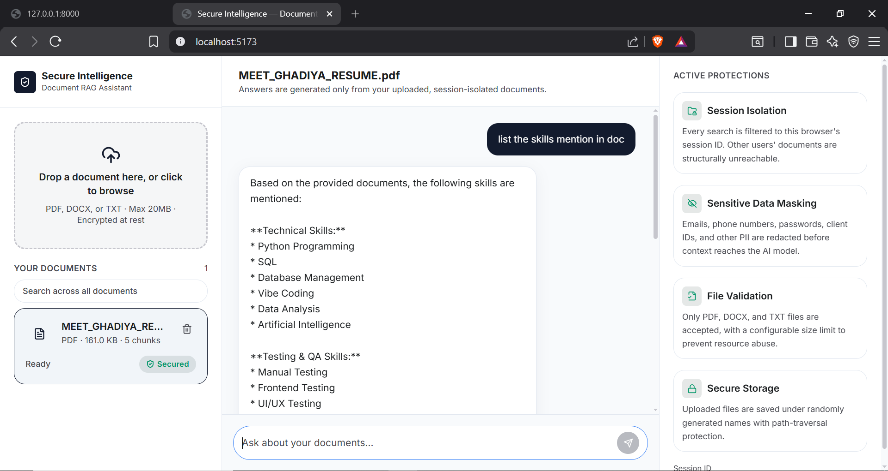

# Secure Document Query System (RAG)

A privacy-first Retrieval-Augmented Generation (RAG) assistant. Upload PDF, DOCX,
or TXT documents and ask natural-language questions about them — answers are
generated only from your own uploaded documents, using the Google Gemini API,
with strict session isolation and sensitive-data masking along the way.

## Highlights

- **Session-based document isolation** — every document and every vector search
  is scoped to a random per-browser session ID; there is no way for one session
  to retrieve another session's content.
- **Sensitive data masking** — emails, phone numbers, passwords, client IDs,
  credit card numbers, and other PII are redacted from retrieved context
  *before* it is sent to Gemini.
- **RAG pipeline** — Sentence Transformers embeddings, ChromaDB vector storage,
  and Gemini-generated answers with source-chunk citations.
- **Secure file handling** — extension allow-list, size limits, randomized
  storage filenames, and path-traversal protection.

## Quick start

### 1. Backend

```bash
cd backend
python3 -m venv .venv
source .venv/bin/activate       # Windows: .venv\Scripts\activate
pip install -r requirements.txt
cp .env.example .env
# edit .env and set GEMINI_API_KEY
uvicorn app.main:app --reload --port 8000
```

### 2. Frontend

```bash
cd frontend
npm install
npm run dev
```

Open the printed local URL (default `http://localhost:5173`). The Vite dev
server proxies `/api` requests to the backend on port 8000.

> Running on Windows? See [`docs/Run.md`](docs/Run.md) for PowerShell-specific setup steps.

## Demo screenshot




## Documentation

- [`docs/Architecture.md`](docs/Architecture.md) — system design and data flow
- [`docs/API.md`](docs/API.md) — endpoint reference
- [`docs/Security.md`](docs/Security.md) — security measures and production
  hardening notes
- [`docs/Deployment.md`](docs/Deployment.md) — deployment guidance
- [`docs/Run.md`](docs/Run.md) — Windows-specific setup steps

## Project structure

```text
secure-document-rag/
├── backend/
│   ├── app/
│   │   ├── api/            # FastAPI route handlers
│   │   ├── database/       # SQLite metadata layer
│   │   ├── models/         # Pydantic schemas
│   │   ├── rag/            # embeddings, vector store, retriever
│   │   ├── security/       # session, file validation, PII masking
│   │   ├── services/       # text extraction, document pipeline, Gemini client
│   │   └── main.py
│   ├── uploads/
│   ├── chroma_db/
│   ├── requirements.txt
│   └── .env.example
├── frontend/
│   ├── src/
│   ├── public/
│   └── package.json
├── docs/
└── README.md
```

## Configuration

See `backend/.env.example` for all available settings (Gemini API key/model,
chunk size/overlap, upload size limit, top-K retrieval count, CORS origins).

Note: The project includes a Gemini model fallback chain and retry logic.
In local testing the configured model chain (`GEMINI_MODEL` + `GEMINI_MODEL_FALLBACKS`) ran successfully and produced answers from uploaded documents.

## Future enhancements

JWT-based authentication and RBAC, PostgreSQL support, OCR for scanned
documents, persistent conversation history, multi-document collections,
streaming responses, audit logging, and cloud deployment.
